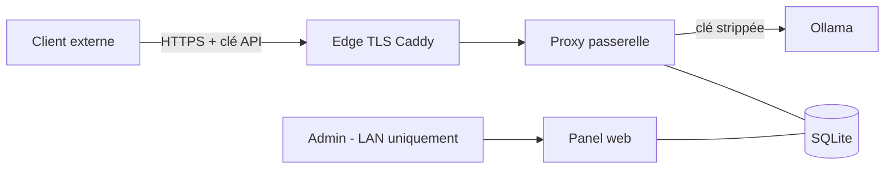
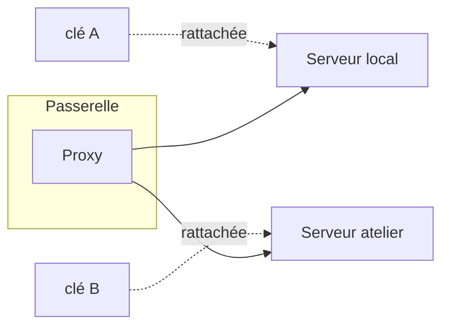
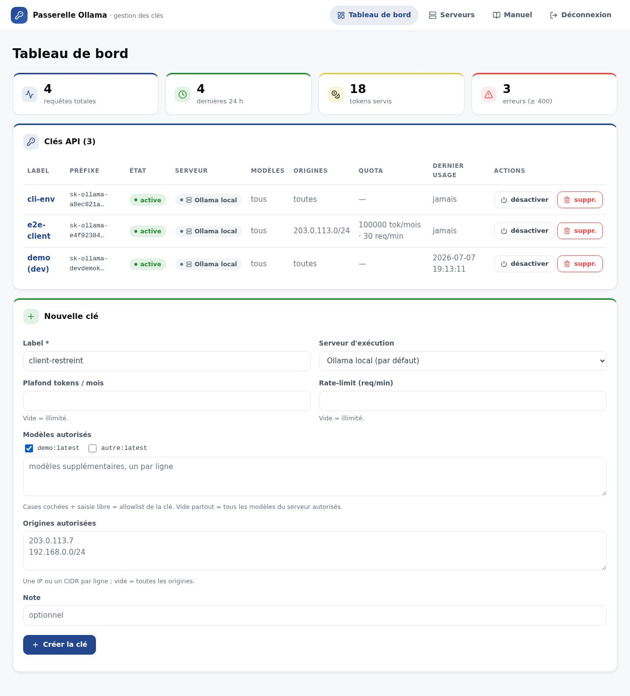
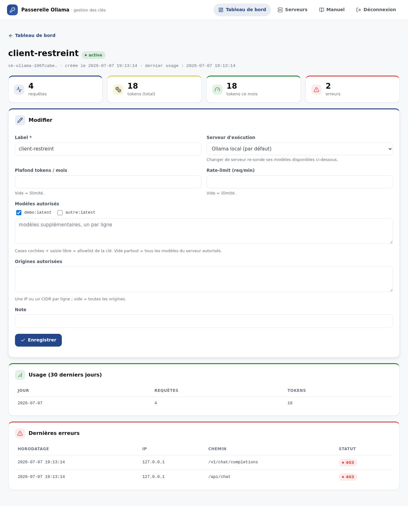
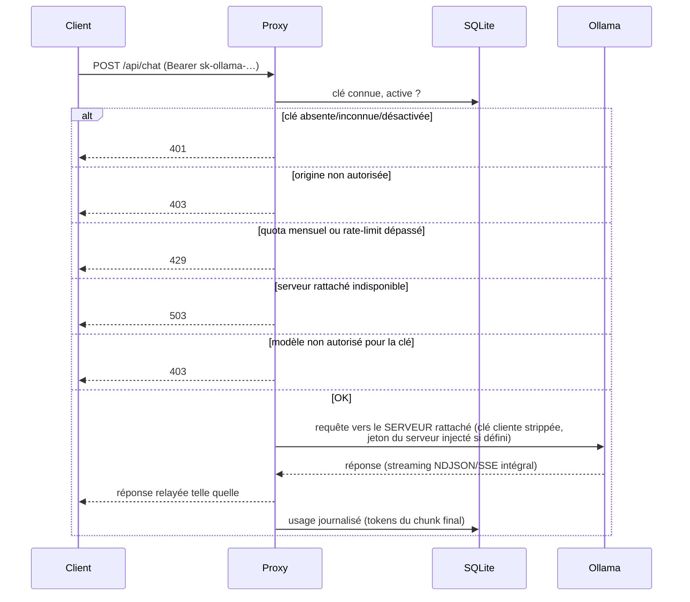
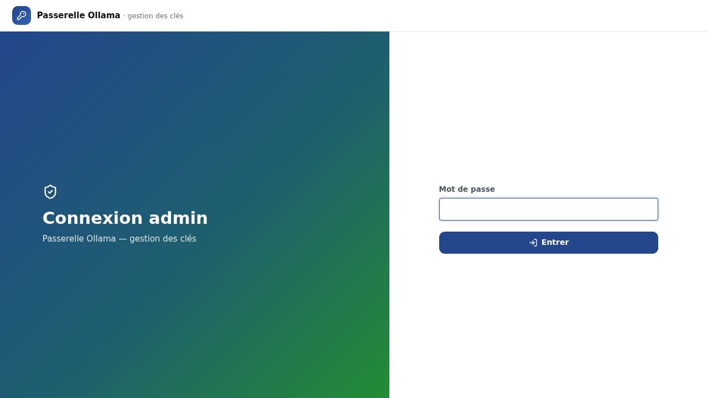
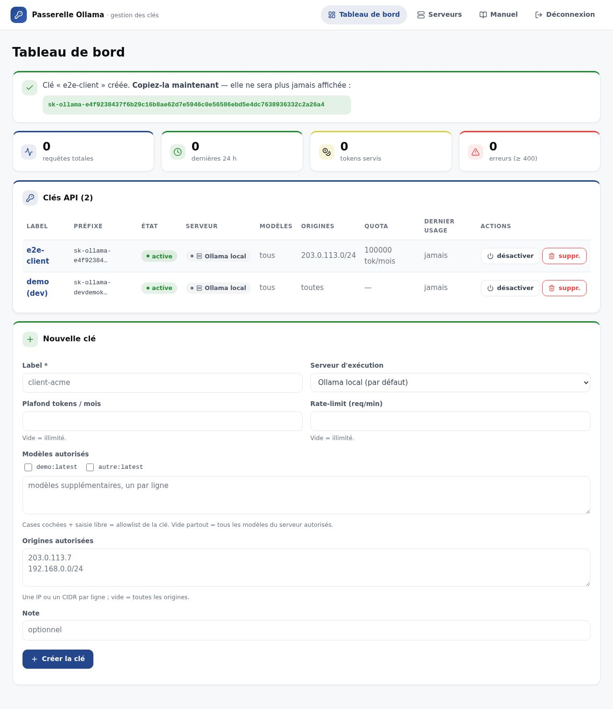
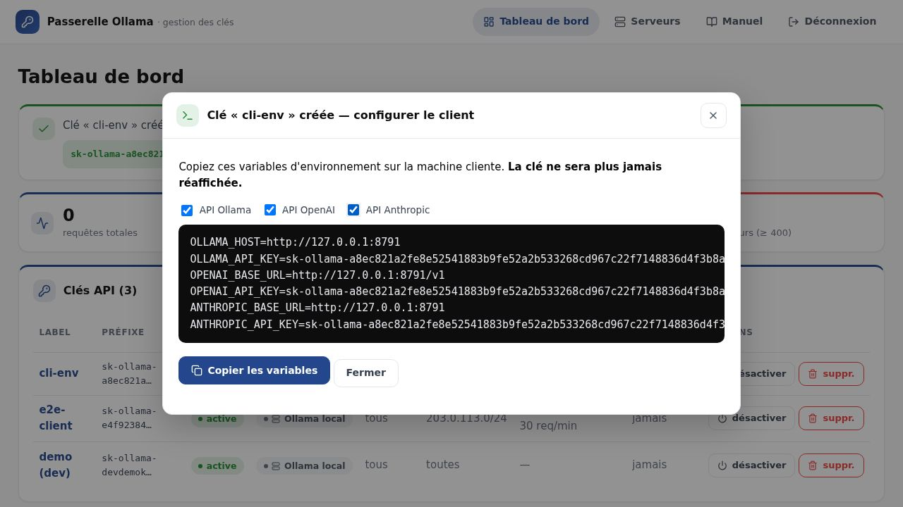
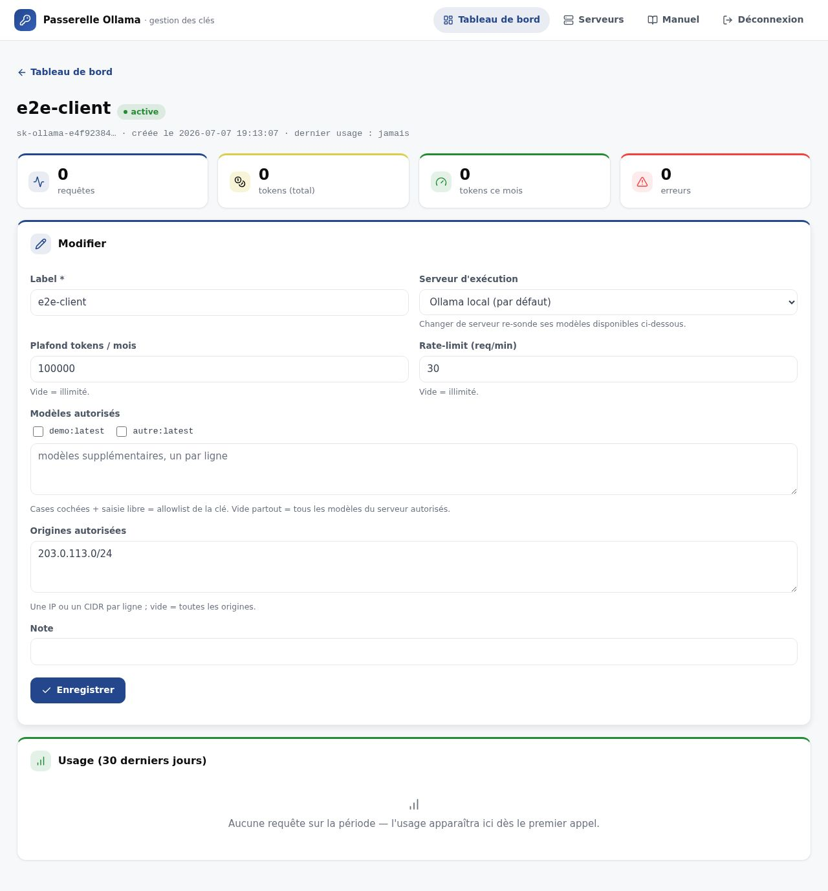
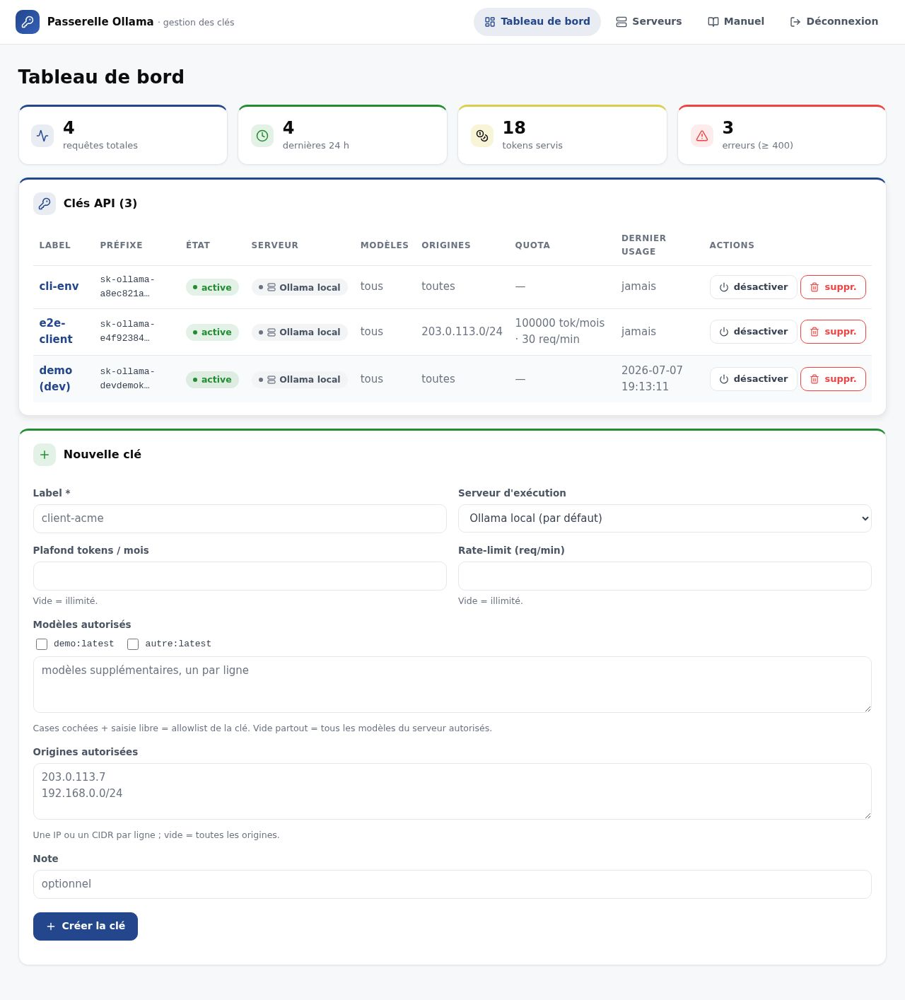

# Manuel — Passerelle de clés Ollama

Document **public** : il explique le fonctionnement de l'application, sans détail
d'infrastructure (aucun hôte, aucune IP, aucun secret). Il est synchrone avec le code —
tout changement de comportement ou d'interface met à jour ce manuel **et ses captures**
dans le même chunk (captures régénérées par l'E2E : `npm test` puis `npm run sync-manual`
dans `e2e/`). Il est consultable dans le panel d'admin via le bouton **Manuel** de la
navigation (modale).

## À quoi sert la passerelle ?

Un serveur Ollama n'a pas d'authentification : quiconque peut le joindre peut consommer
du calcul. La passerelle se place devant lui et ajoute :

- des **clés API par client** (`Authorization: Bearer sk-ollama-…`), révocables une à une ;
- une **restriction d'origine** par clé (liste d'IP ou de blocs CIDR autorisés) ;
- des **quotas** : plafond mensuel de tokens et/ou limite de requêtes par minute ;
- une **journalisation d'usage** par requête (compteurs de tokens compris) ;
- un **panel d'admin web** pour gérer tout cela, accessible uniquement depuis le réseau local.

Deux rôles distincts tournent à partir du même code (variable `GATEWAY_ROLE`) :

- le **proxy** — la seule surface exposée publiquement (derrière le TLS) ;
- l'**admin** — jamais exposé à Internet, réservé au réseau local.

## Serveurs d'exécution (« executors »)

La passerelle peut router les clés vers **plusieurs serveurs Ollama** : le serveur **local**
(créé automatiquement, indélébile) et des **serveurs distants** ajoutés à la main (par exemple
d'autres machines du réseau). **Chaque clé est rattachée à exactement un serveur.**

Depuis la page **Serveurs** :

- **Ajouter un serveur** : un nom, une URL de base, et — si le serveur distant exige une
  authentification — un **jeton Bearer** (chiffré au repos, jamais réaffiché).
- **Tester** un serveur : la passerelle interroge sa liste de modèles ; le serveur passe
  « en ligne » ou « hors ligne » et ses modèles détectés s'affichent.
- **Activer / désactiver** ou **supprimer** un serveur (le serveur par défaut et un serveur
  avec des clés rattachées ne peuvent pas être supprimés).

### Restreindre les modèles d'une clé

Sur une clé (à la création comme à l'édition), on choisit son **serveur** ; le formulaire
**sonde alors ce serveur en direct** et affiche ses modèles réellement disponibles sous forme
de **cases à cocher** — changer de serveur re-sonde et met à jour les cases. Si le serveur est
injoignable, le formulaire **replie en saisie libre** (un modèle par ligne). L'allowlist de la
clé = cases cochées + saisie libre ; liste vide = tous les modèles du serveur autorisés.

La restriction s'applique **quelle que soit l'API** utilisée par le client (Ollama natif,
OpenAI Chat/Responses, Anthropic Messages) : une requête vers un modèle non autorisé est
refusée (403), et les listes de modèles (`/api/tags`, `/v1/models`) sont **filtrées** pour ne
montrer que les modèles permis.

## Cycle de vie d'une requête

Points de comportement :

- **Tous** les endpoints Ollama sont proxifiés (`/api/*`, `/v1/*`) ; `/_proxy_health`
  répond sans authentification pour la supervision.
- La requête est routée vers le **serveur d'exécution rattaché à la clé** (local ou distant) ;
  si ce serveur est désactivé/absent → 503.
- La **restriction de modèle** est appliquée avant le relais, quelle que soit l'API (Ollama,
  OpenAI, Anthropic) : modèle non autorisé → 403 ; les listings sont filtrés.
- Le **streaming est intégral** : les chunks sont relayés au fil de l'eau ; le comptage de
  tokens lit le payload final (`eval_count`, `prompt_eval_count`) y compris en streaming.
- La clé du client est **strippée avant l'amont** ; si le serveur distant exige un jeton, la
  passerelle l'injecte (déchiffré) à sa place. Ollama ne voit jamais la clé cliente.
- Les erreurs (≥ 400) sont journalisées et visibles dans le panel.

## Les clés API

| Propriété | Effet |
|---|---|
| Label | nom lisible (ex. `client-acme`) |
| Secret | affiché **une seule fois** à la création ; seul un hachage est stocké |
| État | une clé désactivée répond immédiatement 401 (réactivable sans changer le secret) |
| Origines | liste d'IP/CIDR (v4/v6) ; vide = toutes les origines |
| Plafond mensuel | budget de tokens par mois calendaire ; dépassé → 429 |
| Rate-limit | requêtes par minute glissante ; dépassé → 429 |
| Serveur | serveur d'exécution rattaché (exactement un ; local par défaut) |
| Modèles | liste de modèles autorisés sur ce serveur ; vide = tous autorisés |

La suppression d'une clé est définitive (l'historique d'usage agrégé reste comptabilisé).

## Le panel d'admin, fonctionnalité par fonctionnalité

L'interface applique la charte graphique P2Enjoy (voir `docs/DESIGN_SYSTEM.md`).

### Connexion (et première utilisation)

À la toute première utilisation, un écran d'initialisation demande de définir le mot de
passe admin (8 caractères minimum). Ensuite, l'accès passe par l'écran de connexion :

### Tableau de bord

Vue d'ensemble : les quatre compteurs globaux (requêtes totales, dernières 24 h, tokens
servis, erreurs ≥ 400), la table des clés (état, origines, quotas, dernier usage) avec les
actions **désactiver/activer** et **supprimer** (confirmation exigée), et le formulaire de
création en bas de page :

### Création d'une clé

Le formulaire demande un label (obligatoire), un plafond mensuel de tokens et un rate-limit
optionnels, les origines autorisées (une IP/CIDR par ligne, vide = toutes) et une note. À la
création, le **secret est affiché une seule fois** dans un bandeau vert — il faut le copier
immédiatement, il ne sera plus jamais montré :

### Configurer le client distant (variables d'environnement)

À la création d'une clé, une **modale de configuration** s'ouvre automatiquement : elle
génère les **variables d'environnement prêtes à copier** pour la machine cliente, selon les
API cochées :

| API cochée | Variables générées |
|---|---|
| Ollama | `OLLAMA_HOST`, `OLLAMA_API_KEY` |
| OpenAI | `OPENAI_BASE_URL` (suffixe `/v1`), `OPENAI_API_KEY` |
| Anthropic | `ANTHROPIC_BASE_URL`, `ANTHROPIC_API_KEY` |

Le bouton **Copier les variables** met le bloc dans le presse-papiers en un clic. L'URL de
base provient de la variable d'env `PUBLIC_BASE_URL` de la passerelle (si absente, un
placeholder à remplacer est affiché). Comme le secret n'est affiché qu'une seule fois, cette
modale n'apparaît qu'au moment de la création.

Côté authentification, la passerelle accepte la clé en `Authorization: Bearer` (clients
Ollama et OpenAI) **et** en en-tête `x-api-key` (comportement du SDK Anthropic configuré via
`ANTHROPIC_API_KEY`) ; dans les deux cas, la clé est retirée avant l'appel au serveur amont.

### Détail et édition d'une clé

Chaque clé a sa page : statistiques dédiées (requêtes, tokens total et du mois, erreurs),
formulaire d'édition (label, quotas, origines, note), usage des 30 derniers jours et
dernières erreurs :

### Suivi de l'usage

Dès qu'une clé sert des requêtes, les compteurs du tableau de bord et le dernier usage par
clé se mettent à jour (les tokens sont comptés y compris en streaming) :

### Manuel intégré

Ce manuel est accessible à tout moment via le bouton **Manuel** de la navigation, affiché
dans une fenêtre modale (fermeture par la croix, la touche Échap ou un clic hors de la
fenêtre).

## Journal des changements

Voir `CHANGELOG.md` (chapitres *Non publié* / *Publié*), publiable aux mêmes conditions
que ce manuel : zéro secret, zéro hôte réel.
